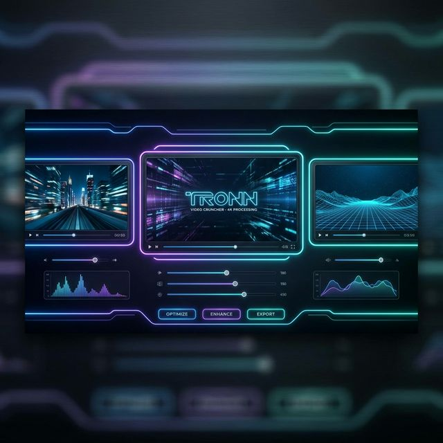

# Tronn Video Cruncher

**Tronn Video Cruncher** is a high-performance, mobile-first video processing application that runs entirely in your web browser. Built with Next.js and powered by `FFmpeg.wasm`, it allows users to transform single videos into cinematic triple-panel layouts without any server-side processing.



## Features

- **Client-Side Processing**: Leverages WebAssembly (FFmpeg.wasm) to process videos locally, ensuring privacy and bypassing server upload limits.
- **Triple-Panel Layout**: Automatically generates a $1280 \times 256$ output with three panels:
  - **Left**: $512 \times 256$ (Cropped/Scaled)
  - **Center**: $512 \times 256$ (Cropped/Scaled)
  - **Right**: $256 \times 256$ (Letterboxed/Padded on Black)
- **Mobile-First UX**: A premium, responsive interface designed for iOS and Android, including "Add to Home Screen" support.
- **Privacy Focused**: Your videos never leave your device. All crunching happens locally.

## Getting Started

### Prerequisites

- Node.js (Latest LTS recommended)
- npm or yarn

### Installation

1. Clone the repository:
   ```bash
   git clone https://github.com/totomakes/TronnVideoCrunch.git
   cd TronnVideoCrunch
   ```

2. Install dependencies:
   ```bash
   npm install
   ```

3. Run the development server:
   ```bash
   npm run dev
   ```

4. Open [http://localhost:3000](http://localhost:3000) in your browser.

## Tech Stack

- **Framework**: [Next.js](https://nextjs.org/)
- **Video Engine**: [@ffmpeg/ffmpeg](https://github.com/ffmpegwasm/ffmpeg.wasm)
- **Styling**: Vanilla CSS (Premium Glassmorphism)
- **Icons**: [Lucide React](https://lucide.dev/)

## Deployment

This app is optimized for static deployment on [Vercel](https://vercel.com/). Ensure that your deployment includes the following headers for FFmpeg.wasm compatibility (configured in `next.config.ts`):

- `Cross-Origin-Opener-Policy: same-origin`
- `Cross-Origin-Embedder-Policy: require-corp`

---

Built for high-performance mobile video workflows.
